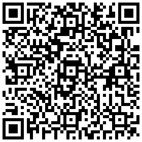

# 🏓🥋 Placar Esportivo Profissional para OBS Studio

Este projeto foi desenvolvido para suprir uma necessidade real em transmissões esportivas ao vivo (*livestreams*). Ele consiste em um ecossistema de **Placares Visuais** e **Painéis de Controle dedicados** integrados nativamente ao **OBS Studio**, funcionando de forma 100% gratuita, sem a necessidade de instalar plugins externos ou depender de plataformas pagas de terceiros.

---

## 🚀 Finalidade e Diferenciais do Projeto

* **Independência de Cenas:** Os placares e os painéis de controle se comunicam em tempo real via internet utilizando links seguros do *GitHub Pages*. Isso significa que você pode alternar livremente entre cenas no OBS (colocar replays, comerciais, telas de espera), e o placar **nunca vai resetar ou perder os dados dos bastidores**.
* **Alinhamento e Estética Impecáveis:** Desenvolvido puramente em HTML5 e CSS3, os blocos visuais e as fontes possuem tamanhos e alinhamentos fixos. Diferente de placares manuais montados com fontes de texto soltas, os números e nomes nunca saem do lugar ou desalinham, mantendo o padrão visual das grandes redes de TV.
* **Operação Ágil e Simplificada:** Os painéis de controle são acoplados diretamente na interface do OBS como *Painéis Personalizados (Docks)*. O operador da transmissão gerencia nomes, rounds, categorias e pontos em tempo real através de cliques ou atalhos de teclado (como a Barra de Espaço para Play/Pause no cronômetro), sem precisar tirar o foco da live.
* **Leveza e Desempenho:** Por rodar como fontes de navegador nativas do OBS, o sistema consome praticamente zero processamento (CPU/GPU), garantindo uma transmissão fluida e sem travamentos.

---

## 📊 Modalidades Inclusas no Repositório

1. **Tênis de Mesa (`placar.html` / `painel.html`):** Layout moderno no formato empilhado vertical, ideal para suportar nomes longos e siglas de estados/clubes sem esmagar o texto. Inclui indicador visual de saque.
2. **Jiu-Jitsu (`placar_jiujitsu.html` / `painel_jiujitsu.html`):** Placar baseado nos padrões oficiais da **IBJJF**, contendo tarja superior escura para o cronômetro/categoria e blocos coloridos fixos para a contagem exata de **Pontos (Azul)**, **Punições (Amarelo)** e **Vantagens (Vermelho)**.
3. **Lutas / MMA (`placar_luta.html` / `painel_luta.html`):** Visual minimalista inspirado nas transmissões do **UFC**, focado em exibir o Round atual, Cronômetro regressivo com comando de pausa rápida, indicador de córner (cor da bermuda) e uma tarja inferior estilizada com a categoria de peso do combate.

---

## 🛠️ Tecnologias Utilizadas
* **HTML5 & CSS3:** Para a estrutura, alinhamento simétrico e efeitos visuais translúcidos (transparência ajustada).
* **JavaScript (Vanilla):** Lógica de funcionamento dos cronômetros e seletores.
* **BroadcastChannel API:** Tecnologia nativa do navegador que faz a comunicação instantânea entre o que o operador clica no painel e o que o público assiste na tela da stream.

---

## ☕ Apoie o Projeto!

Este projeto consumiu muitas horas de testes, lógica, erros e acertos para chegar a um formato profissional, leve e prático que o mercado não oferece gratuitamente. Se estes placares foram úteis para a sua transmissão, economizaram o seu tempo ou profissionalizaram a sua live, considere fazer uma contribuição para apoiar o desenvolvedor e incentivar novas modalidades!

### 💰 Contribua via PIX:
* **Chave PIX:** `caetano3dsigner@hotmail.com`
* 
* **Nome do Beneficiário:** [Luiz Carlos da Silva Caetano]
* **Nota de apoio:** *Se puder, envie uma mensagem dizendo qual modalidade você está transmitindo com o placar!*

Muito obrigado por apoiar o desenvolvimento independente e boas transmissões! 🎥🚀
